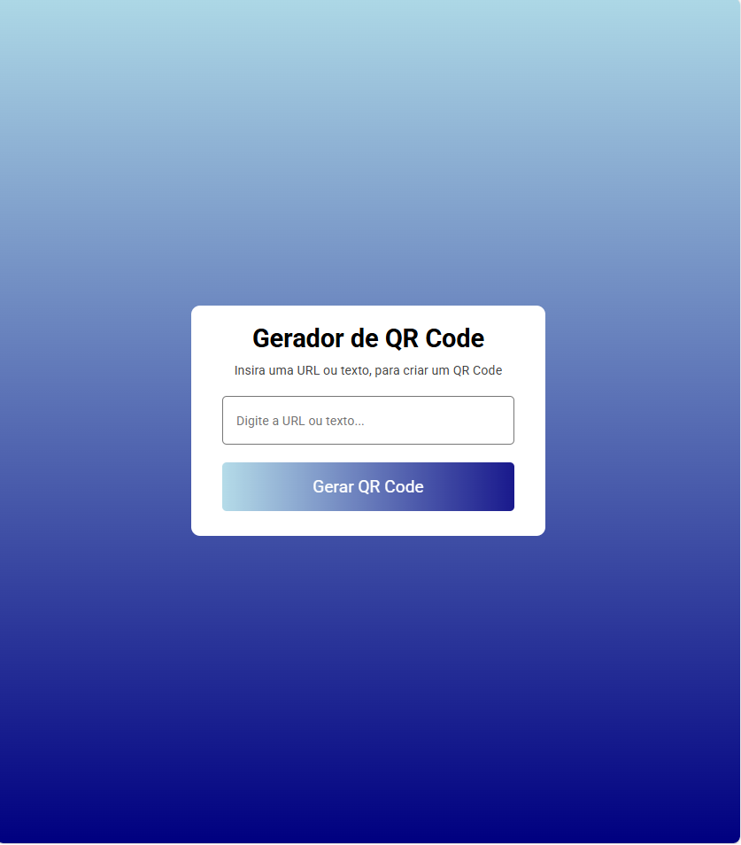
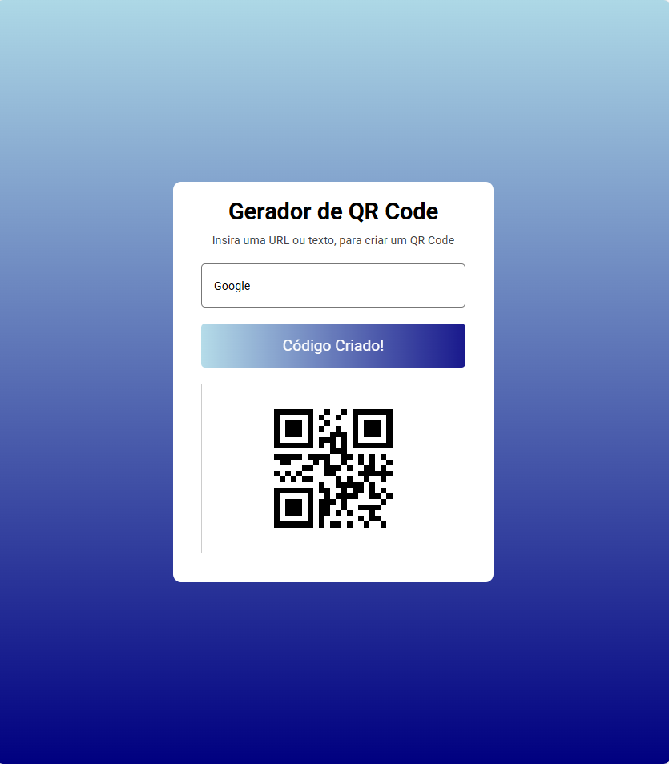

## 📷 Gerador de QR Code
Uma aplicação web simples que gera QR Codes a partir de URLs ou textos fornecidos pelo usuário.

## ✨ Funcionalidades
- Geração dinâmica de QR Codes utilizando a API QR Code Generator.
- Interface responsiva e amigável ao usuário.
- Feedback visual durante o processo de geração e em casos de erro.
- Reset automático da interface quando o campo de entrada é limpo.

## 🚀 Tecnologias Utilizadas
- HTML5
- CSS3
- JavaScript (ES6)

## 🛠️ Como Utilizar
Clone o repositório:

bash
git clone https://github.com/seu-usuario/gerador-qr-code.git

Navegue até o diretório do projeto:

bash
Copiar
Editar
cd gerador-qr-code
Abra o arquivo index.html no seu navegador preferido.

## 📄 Licença
Este projeto está licenciado sob a MIT License.

